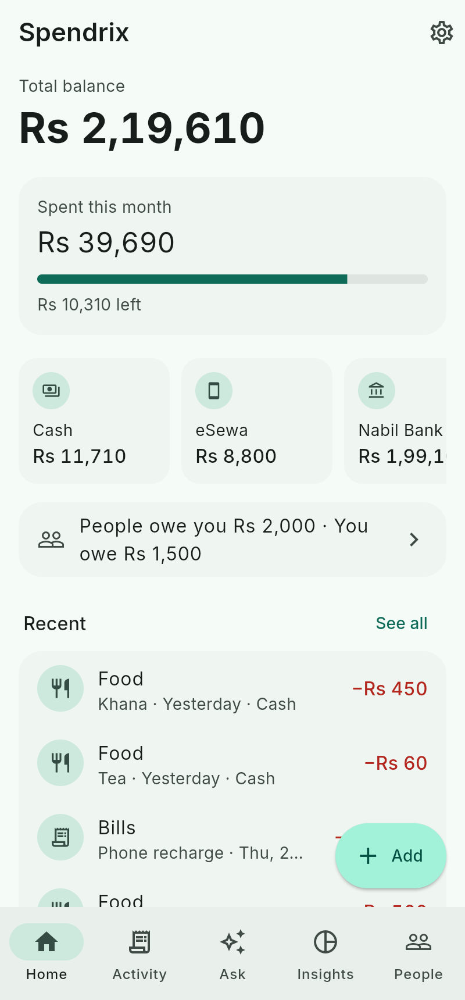
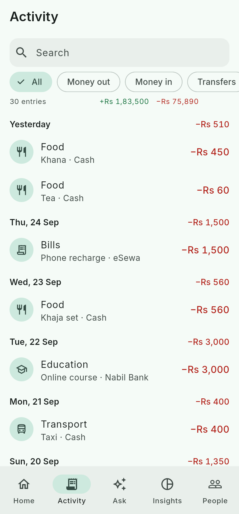
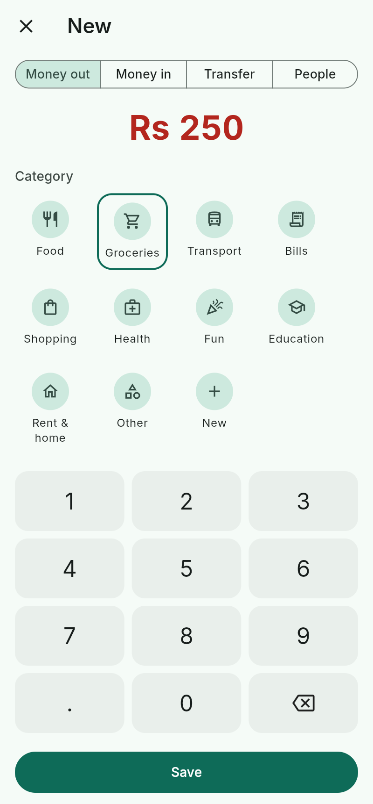
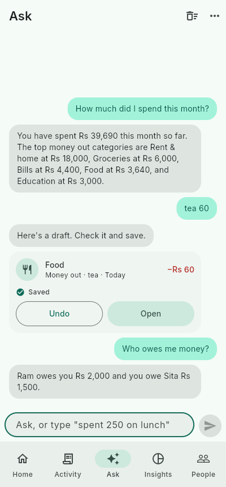
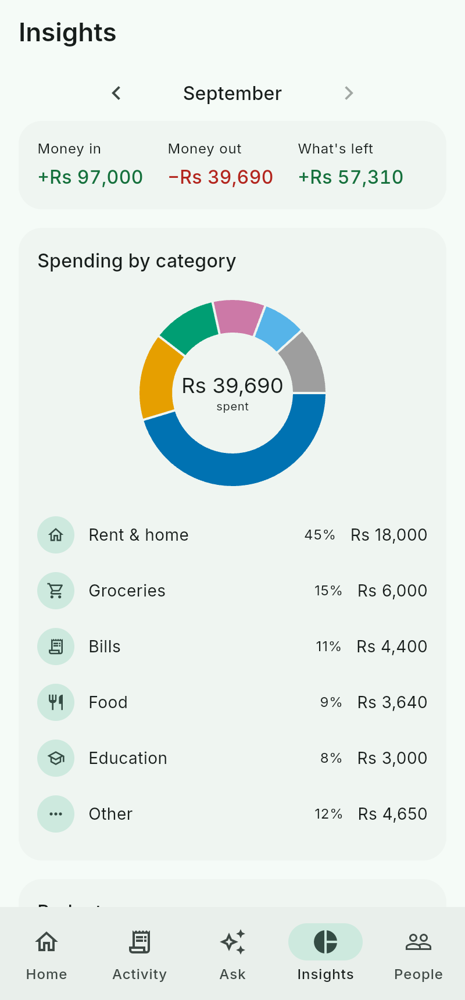
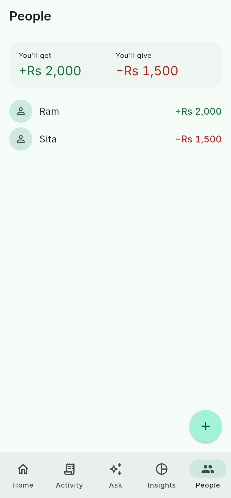
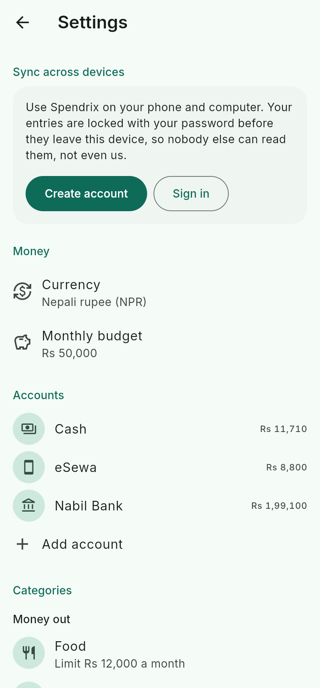

# How to use Spendrix

Spendrix has five tabs: **Home**, **Activity**, **Ask**, **Insights** and **People**. Settings is the gear on Home.

Sharper version: [walkthrough video](docs/walkthrough.mp4).

## First start

Tap **Get started** and pick your currency. That's it, no account needed. Spendrix starts you with a Cash account and a few categories, and you can change all of them in Settings.

Already use Spendrix on another device? Tap **I already use Spendrix** and sign in with your sync email and password. Your entries come down and unlock on this device.

## Add money in and out

Tap **Add** on Home. Type the amount on the keypad, pick **Money out** or **Money in**, choose a category and tap **Save**.

- **Transfer** moves money between your own accounts, like cash to bank. Both balances change, but it doesn't count as spending.
- **People** records money you lent someone or borrowed from them.
- **More** lets you add a note, attach a receipt photo or make it repeat.

Tap any entry in Activity to change or delete it. Search and the filters at the top narrow the list down.

## Talk to it

The **Ask** tab is a chat with a helper that runs on your own device. The first time, it asks to download the AI once (about 2.6 GB, or 2 GB in a browser). After that it works with no internet.

- **Type** it: "tea 60", "salary 50000", "lent Ram 2000".
- **Say** it: tap the mic, say "khana 450" or "बिजुली बिल ११००", then tap stop. Nepali and English both work. Cancel throws the recording away.
- **Snap** it: tap the camera and take a photo of a bill, or pick one you already have.

Spendrix writes the entry as a card. Check it and tap **Save**, or **Edit** to change anything first. You can also ask questions like "How much did I spend on food this month?" or "Who owes me money?".

Your voice, photos and entries never leave the device.

## See where the money goes

**Insights** shows each month's money in, money out and what's left, with a chart by category. Tap the arrows to go back a month.

Set a monthly budget and a limit for any category in Settings. Home then shows how much is left for the month.

## People

**People** shows who owes you and whom you owe. Tap **+** to add someone, then open them and tap **You gave** when you lend money or **You got** when you borrow. Tap **Settle up** when it's paid back.

## Repeating bills

For rent, salary or a phone bill, open **More** when adding and set **Repeat**. Spendrix adds it on each due date, the next time you open the app. Pause or delete a repeat in Settings.

## Sync your devices

Sync is optional. In Settings, tap **Create account** and pick an email and password. Then sign in with the same email and password on your other phone, computer or at [spendrix.web.app](https://spendrix.web.app).

Your entries are locked with your password on the device before they're sent. The server only stores locked data, so nobody else can read it. That also means **Spendrix can't reset your password**. If you forget it, your data on each device is still safe, but the synced copy can't be opened. Delete the account and start a new one.

Receipt photos stay on the device they were taken on.

## Lock the app

Turn on **Lock with fingerprint or PIN** in Settings. Spendrix then asks for your fingerprint, face or phone PIN when it opens, and again after you've been away for 30 seconds. It works on Android, iPhone, Mac (Touch ID) and Windows (Windows Hello). You need a screen lock set on the device first. Turning the lock off asks for your fingerprint or PIN too.

## Back up and export

- **Back up** saves everything, photos included, into one file. Keep it somewhere safe.
- **Restore** brings a backup back on any device.
- **Export to a spreadsheet** saves a CSV file for Excel or Google Sheets.

## Where the helper works

| Device | Chat | Voice | Receipt photos |
|---|---|---|---|
| Android (64-bit) | yes | yes | yes |
| iPhone and iPad | yes | yes | yes |
| Mac with Apple chip | yes | yes | yes |
| Windows and Linux (64-bit) | yes | yes | yes |
| Browser (Chrome or Edge) | yes | no | no |

On phones with less than 6 GB of memory the helper may be slow or fail to start. Everything else in Spendrix works without it.
