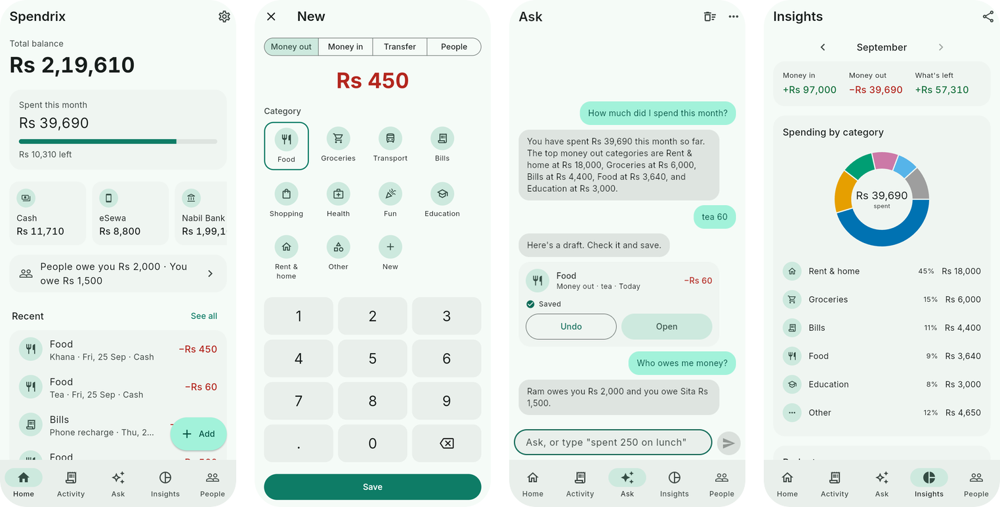

<div align="center">


# Spendrix

**A private money diary that never leaves your device.**

Type, speak in Nepali or English, or snap a receipt. A helper running on your own phone or computer writes the entry for you. No account, no ads, works offline.

[](https://github.com/kafle1/spendrix/releases/latest)
[](https://github.com/kafle1/spendrix/releases)


[**Website**](https://spendrix.web.app) · [**Open in browser**](https://spendrix.web.app/app/) · [**Download**](#download) · [**Guide**](GUIDE.md) · [**Privacy**](https://spendrix.web.app/privacy/)

<br>



</div>

<br>

## Download

| | Device | File | How to install |
|---|---|---|---|
| 🤖 | **Android** | [`Spendrix-android.apk`](https://github.com/kafle1/spendrix/releases/latest/download/Spendrix-android.apk) | Open it on your phone and allow the install |
| 🍎 | **iPhone** | [`Spendrix-iphone.ipa`](https://github.com/kafle1/spendrix/releases/latest/download/Spendrix-iphone.ipa) | Sideload with AltStore or Sideloadly until it's on the App Store |
| 💻 | **Mac** | [`Spendrix-macos.dmg`](https://github.com/kafle1/spendrix/releases/latest/download/Spendrix-macos.dmg) | Drag to Applications. It isn't signed yet, so the first open is blocked. Go to System Settings, Privacy & Security, and click Open Anyway |
| 🪟 | **Windows** | [`Spendrix-windows.zip`](https://github.com/kafle1/spendrix/releases/latest/download/Spendrix-windows.zip) | Unzip and run `spendrix.exe`. It isn't signed yet, so Windows says it protected your PC the first time. Click More info, then Run anyway |
| 🐧 | **Linux** | [`Spendrix-linux-x64.tar.gz`](https://github.com/kafle1/spendrix/releases/latest/download/Spendrix-linux-x64.tar.gz) | Extract and run `./spendrix` |
| 🌐 | **Browser** | [spendrix.web.app/app](https://spendrix.web.app/app/) | Nothing to install |

Every file is on the [latest release](https://github.com/kafle1/spendrix/releases/latest) page too.

<details>
<summary><b>Updating from an older version</b></summary>

<br>

Install the new file over the old app. **Don't uninstall first**, that deletes your data. From 2.0.2 on, Spendrix shows a card on Home when a new version is out and links you to the right file.

On Android, `Spendrix-android.apk` updates every older Spendrix, 1.2 and older included. The one exception: if you have 1.3, or got 2.0.0 or 2.0.1 from `Spendrix-android.apk`, take [`Spendrix-android-for-1.3-and-2.0.apk`](https://github.com/kafle1/spendrix/releases/latest/download/Spendrix-android-for-1.3-and-2.0.apk) once instead. Those were installed under a different app id, and a phone only updates an app with the same id.

</details>

## See it in action

<div align="center">
<a href="site/media/promo.mp4"></a>
<br><sub>40 second intro. The <a href="docs/walkthrough.mp4">full walkthrough</a> shows every screen.</sub>
</div>

## What it does

<table>
<tr>
<td width="50%" valign="top">

**✍️ Write it down fast**<br>
Money out, money in, transfers between your accounts, and money you lent or borrowed. Bills that repeat add themselves on the day they're due, every week, every 3 months or however often you set.

</td>
<td width="50%" valign="top">

**🗣️ Just say it**<br>
Say "khana 450" or "बिजुली बिल ११००" and it drafts the entry. Tap Save. Take a photo of a receipt and it fills in the amount, date and shop.

</td>
</tr>
<tr>
<td valign="top">

**💬 Ask your money**<br>
"How much did I spend on food last month?" Or tell it what to do, like "Rent 15000 every month" or "Delete the last entry". It shows the change first, and you can undo it.

</td>
<td valign="top">

**📊 See where it goes**<br>
Monthly charts and category totals. Keep track of who owes you and who you owe.

</td>
</tr>
<tr>
<td valign="top">

**🔒 Private by default**<br>
Everything stays on your device. Optional sync locks every entry on your device before it leaves, so nobody else can read it, us included.

</td>
<td valign="top">

**🧰 The rest**<br>
Backup to a file, export to a spreadsheet, app lock with fingerprint or face, and dark mode.

</td>
</tr>
</table>

The full walkthrough with screenshots is in [GUIDE.md](GUIDE.md).

## The helper

The helper is Google's **Gemma 4** model. It runs on your device, needs no account and sends nothing anywhere. You download it once from inside the app, then it works offline.

The app checks the device's memory and picks the size that runs well on it:

| Device | Model | Size |
|---|---|---|
| Phones with 12 GB of memory, Macs with 16 GB, Windows or Linux PCs with 24 GB | Gemma 4 E4B, reads Nepali and receipts better | about 3.7 GB |
| Every other device, so it stays fast | Gemma 4 E2B | about 2.6 GB |
| Browser | Gemma 4 E2B, text only | about 2 GB |

A helper that's already downloaded stays as it is. Remove it and download again to get the other size.

| Where | Chat | Voice | Receipt photos |
|---|:---:|:---:|:---:|
| Android (64-bit phones) | ✅ | ✅ | ✅ |
| iPhone and iPad (real devices) | ✅ | ✅ | ✅ |
| Mac with Apple chip | ✅ | ✅ | ✅ |
| Windows and Linux (64-bit Intel or AMD) | ✅ | ✅ | ✅ |
| Browser (Chrome or Edge with WebGPU) | ✅ | | |

Phones with less than 6 GB of memory may be slow or unable to load it. Everything else in Spendrix works without the helper. Voice on Linux needs `parecord`, which most desktops already have (package `pulseaudio-utils`).

## Sync and privacy

Sync is optional. You sign in with Google, and a random key made on your device locks every entry with **AES-256** before it's sent to Firebase. The server only ever sees locked data.

- The key lives on your devices and in a hidden app folder in your Google Drive (the `drive.appdata` scope), so a new device finds it by itself. Settings has **Show sync key** as a backup.
- Accounts from 2.1 were locked with a key made from the password. That key stays. A 2.1 device that still syncs links Google to the account and puts the key in Drive, so no password is ever asked for again.
- Receipt photos stay on the device they were taken on.
- If two devices change the same entry, the newest change wins.

Each time it opens, Spendrix asks GitHub for the latest version number so it can tell you about updates. That request carries nothing about you or your money. The browser version skips it, since it's always the newest.

<details>
<summary><b>Usage stats</b></summary>

<br>

Usage stats stay hidden until the Google Analytics ids in `lib/stats.dart` are filled in. After that they are off unless you say yes when Spendrix asks. If you do, it sends anonymous counts to Google Analytics: which screens get opened, which features get used, rough totals like "10-49 entries", and the file and line when something crashes. It never sends amounts, names, notes, photos, audio or anything you type. Turn it off in Settings and the random id and anything unsent are deleted.

</details>

## Build it yourself

You need Flutter 3.47 or newer.

```sh
flutter pub get
flutter run
```

Google sign-in has two local catches. On Mac, Windows and Linux, pass the desktop client secret with `--dart-define=GOOGLE_DESKTOP_SECRET=...` (CI takes it from the repo secret of the same name). In the browser, run on port 7357, the only local port the web client allows: `flutter run -d chrome --web-port 7357`.

<details>
<summary><b>Release builds</b></summary>

<br>

```sh
flutter build apk --release
flutter build ios --release --no-codesign
flutter build macos --release
flutter build windows --release
flutter build linux --release   # needs clang cmake ninja-build libgtk-3-dev lld
flutter build web --release --base-href /app/
```

Pushing a tag like `v2.0.0` builds every platform except the web on GitHub and publishes a release with `RELEASE_NOTES.md` as the notes. The Android job needs two repository secrets:

- `ANDROID_KEYSTORE`: the release keystore, base64 encoded
- `ANDROID_KEY_PASSWORD`: its password (the key alias is `androiddebugkey`, the same key 1.x was signed with)

For a local signed Android build, put the same values in `android/key.properties` (it's gitignored).

The Android app id defaults to `com.example.expenses_tracker`, the id 1.2 and older used. Set `SPENDRIX_APP_ID=com.spendrix` to build the file for people on 1.3 to 2.0.1.

</details>

<details>
<summary><b>Firebase and the website</b></summary>

<br>

Sync uses Firebase Auth (Google sign-in) and Firestore through their REST APIs, and Google Drive for the key. To point it at your own project, change the project id and web API key at the top of `lib/sync.dart`, fill in the OAuth client ids at the top of `lib/google_auth.dart`, enable Google sign-in and the Drive API, then:

```sh
firebase deploy --only firestore:rules
site/build.sh && firebase deploy --only hosting
```

`site/build.sh` builds the web app into `build/site/app/` and copies the landing pages from `site/` next to it, so the website is at `/` and the app at `/app/`. To look at it before deploying, run `python3 site/serve.py` and open http://localhost:8080.

</details>

### Code map

| File | What's in it |
|---|---|
| `lib/store.dart` | Local database (Hive), repeating bills, backup and export |
| `lib/sync.dart` | Sign-in, key setup, encryption and the sync loop |
| `lib/google_auth.dart` | Google sign-in on every platform, and the client ids at the top |
| `lib/ai.dart` | Model download, chat, voice and receipt reading |
| `lib/models.dart` | Entries, accounts, categories, people |
| `lib/screens/` | One file per screen |

## License

All rights reserved. You can read the code and install the app for yourself, but you can't copy, change, share, or sell it. See [LICENSE](LICENSE).

<div align="center">
<br>
<sub>Made in Kathmandu by <a href="https://github.com/kafle1">@kafle1</a></sub>
</div>
