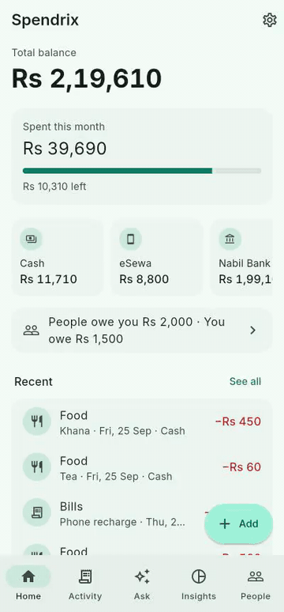

# Spendrix

Spendrix is a private money diary. It works fully offline and keeps everything on your device. It has a helper that runs on your own phone or computer, so you can type, speak (Nepali or English) or snap a receipt and it writes the entry for you.



Sharper version: [walkthrough video](docs/walkthrough.mp4).

## Get it

Grab the latest build from [Releases](https://github.com/kafle1/spendrix/releases/latest).

| Device | File | How |
|---|---|---|
| Android | `Spendrix-android.apk` | Open it on your phone and allow the install. Old 32-bit phones take `Spendrix-android-32bit.apk` (no AI) |
| iPhone | `Spendrix-ios-unsigned.ipa` | Sideload with AltStore or Sideloadly until it's on the App Store |
| Mac | `Spendrix-macos.dmg` | Drag to Applications. It isn't signed yet, so macOS blocks the first open. Go to System Settings, Privacy & Security, and click Open Anyway |
| Windows | `Spendrix-windows.zip` | Unzip and run `spendrix.exe` |
| Linux | `Spendrix-linux-x64.tar.gz` | Extract and run `./spendrix` |
| Browser | [spendrix.web.app](https://spendrix.web.app) | Nothing to install |

## What it does

- Add money out, money in, transfers between your accounts, and money you lent or borrowed.
- Bills that repeat add themselves on the day they're due.
- See where your money goes with monthly charts and category totals.
- Keep track of who owes you and who you owe.
- Ask things like "how much did I spend on food last month?"
- Say "khana 450" or "बिजुली बिल ११००" and it drafts the entry. Tap Save.
- Take a photo of a receipt and it fills in the amount, date and shop.
- Sync between your phone, computer and browser. Everything is locked on your device before it leaves, so nobody else can read it, us included.
- Backup to a file, export to a spreadsheet, app lock with fingerprint or face, dark mode.

The full walkthrough is in [GUIDE.md](GUIDE.md).

## The helper

The helper is Google's Gemma 4 model. It runs on your device, needs no account and sends nothing anywhere. You download it once from inside the app (about 2.6 GB, or 2 GB in the browser), then it works offline.

| Where | Chat | Voice | Receipt photos |
|---|---|---|---|
| Android (64-bit phones) | yes | yes | yes |
| iPhone and iPad (real devices) | yes | yes | yes |
| Mac with Apple chip | yes | yes | yes |
| Windows and Linux (64-bit Intel or AMD) | yes | yes | yes |
| Browser (Chrome or Edge with WebGPU) | yes | no | no |

Phones with less than 6 GB of memory may be slow or unable to load it. Everything else in Spendrix works without the helper.

Voice on Linux needs `parecord`, which most desktops already have (package `pulseaudio-utils`).

## Sync and privacy

Sync is optional. When you turn it on, Spendrix turns your password into two keys on your device. One signs you in. The other locks every entry with AES-256 before it's sent to Firebase. The server only ever sees locked data.

- Forget the password and the synced copy can't be opened. Your data on each device stays safe, and you can start a fresh sync.
- Receipt photos stay on the device they were taken on.
- If two devices change the same entry, the newest change wins.

Usage stats stay hidden until the Google Analytics ids in `lib/stats.dart` are filled in. After that they are off unless you say yes when Spendrix asks. If you do, it sends anonymous counts to Google Analytics: which screens get opened, which features get used, rough totals like "10-49 entries", and the file and line when something crashes. It never sends amounts, names, notes, photos, audio or anything you type. Turn it off in Settings and the random id and anything unsent are deleted.

## Build it yourself

You need Flutter 3.47 or newer.

```sh
flutter pub get
flutter run
```

Release builds:

```sh
flutter build apk --release
flutter build ios --release --no-codesign
flutter build macos --release
flutter build windows --release
flutter build linux --release   # needs clang cmake ninja-build libgtk-3-dev lld
flutter build web --release
```

Pushing a tag like `v2.0.0` builds every platform on GitHub and publishes a release with `RELEASE_NOTES.md` as the notes. The Android job needs two repository secrets:

- `ANDROID_KEYSTORE`: the release keystore, base64 encoded
- `ANDROID_KEY_PASSWORD`: its password (the key alias is `androiddebugkey`, the same key 1.x was signed with)

For a local signed Android build, put the same values in `android/key.properties` (it's gitignored).

### Firebase

Sync uses Firebase Auth (email and password) and Firestore through their REST APIs. To point it at your own project, change the project id and web API key at the top of `lib/sync.dart`, enable Email/Password sign-in, then:

```sh
firebase deploy --only firestore:rules
flutter build web --release && firebase deploy --only hosting
```

## Code map

| File | What's in it |
|---|---|
| `lib/store.dart` | Local database (Hive), repeating bills, backup and export |
| `lib/sync.dart` | Sign-in, key setup, encryption and the sync loop |
| `lib/ai.dart` | Model download, chat, voice and receipt reading |
| `lib/models.dart` | Entries, accounts, categories, people |
| `lib/screens/` | One file per screen |

## License

MIT
